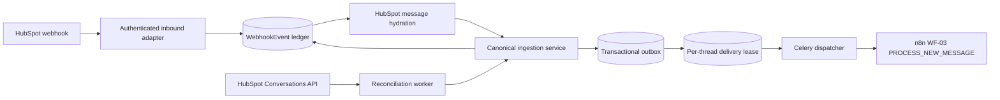

# JUDAH inbound adapter for n8n

## Implemented boundary

JUDAH durably receives HubSpot `conversation.newMessage` envelopes, hydrates
the corresponding Conversations API message, and delivers an immutable event
to n8n. n8n owns dialogue state, customer identification, confirmation, menu,
and triage. This adapter does not execute those decisions and does not call
Matchmaker, change priority, or update a HubSpot owner.



## Persistence and idempotency

- `webhook_events` is the raw provider ledger and preserves the received
  payload, canonical IDs, intake method, processing result, and ignored reason.
- `n8n_outbox_events` stores the exact JSON body and mutable delivery state:
  `PENDING`, `PROCESSING`, `RETRY_SCHEDULED`, `DELIVERED`, `DEAD_LETTER`, or
  `CANCELLED`.
- `hubspot_reconciliation_cursors` stores durable per-thread progress, errors,
  next attempt, and claim timestamp.

The canonical key used by ledger, outbox, payload, header, logs, and metrics is:

```text
sha256("hubspot:" + portal_id + ":" + thread_id + ":" + message_id)
```

The database uniquely constrains the key in ledger and outbox. `IntegrityError`
is handled outside a nested savepoint, so concurrent webhook and reconciliation
attempts converge. A duplicate is a successful no-op. Missing trustworthy IDs
produce `IGNORED/missing_canonical_identifier`; no ID is fabricated.

Ledger completion and outbox creation run in one `transaction.atomic()`.
Celery publication occurs only in `transaction.on_commit()`. A periodic outbox
poller recovers durable rows if the broker is unavailable after commit.

## n8n contract and HMAC

The immutable body has `action="PROCESS_NEW_MESSAGE"` and a real `data` object:

```json
{
  "action": "PROCESS_NEW_MESSAGE",
  "data": {
    "schema_version": "1.0",
    "event": {
      "event_id": "ledger-uuid",
      "type": "conversation.newMessage",
      "message_id": "hubspot-message-id",
      "occurred_at": "2026-08-22T15:00:00Z",
      "source": "judah"
    },
    "hubspot": {
      "portal_id": "portal-id",
      "thread_id": "thread-id",
      "ticket_id": null
    },
    "conversation": {
      "threadId": "thread-id",
      "status": "OPEN",
      "associatedContactId": null,
      "originalChannelId": null,
      "originalChannelAccountId": null
    },
    "gateway": {
      "is_incoming_customer_message": true,
      "delivery_method": "webhook"
    },
    "message": {
      "direction": "INCOMING",
      "text": "message text",
      "created_at": "2026-08-22T15:00:00Z",
      "channel_id": null,
      "channel_account_id": null,
      "sender_actor_id": null
    },
    "delivery_identifiers": {
      "email": null,
      "phone": null,
      "trusted": false,
      "source": null
    },
    "metadata": {
      "idempotency_key": "sha256-hex",
      "service_cycle_id": null
    }
  }
}
```

Required headers are `Content-Type`, `X-Judah-Event-Id`,
`X-Idempotency-Key`, `X-Judah-Timestamp`, `X-Judah-Signature`, and
`X-Delivery-Attempt`. The signature is computed over the exact transmitted
bytes:

```text
HMAC-SHA256(JUDAH_N8N_HMAC_SECRET, timestamp + "." + raw_request_body)
```

A valid response is `2xx` JSON with `status="accepted"` and the matching
`event_id`; `duplicate=true` is accepted. Malformed `2xx`, timeout, connection
failure, `429`, `408`, `425`, `401/403`, and `5xx` are retryable. Other `4xx`
responses are terminal payload rejection.

## Retry, locking, and dead-letter

Claims use short `SELECT ... FOR UPDATE` transactions. Network I/O occurs after
commit. Backoff is exponential with full jitter and a configured cap. A stale
`PROCESSING` claim is recoverable after `N8N_BOT_PROCESSING_STALE_SECONDS`.
Exhausted retryable failures and terminal rejections become `DEAD_LETTER`.
Missing local URL/secret keeps the row scheduled without consuming attempts.

Delivery is serialized by `hubspot_thread_id` through
`n8n_thread_delivery_locks`. The claim transaction locks both the outbox row and
the unique thread lease, stores the owning outbox and releases the database row
locks before HTTP I/O. A second outbox for the same thread cannot be claimed
until the owner finalizes; different threads remain independent. Lease recovery
uses at least the full configured HTTP timeout budget, so a live request cannot
be overtaken merely because the configured stale interval is too short.

Safe dead-letter replay requires fixing the cause, then changing only the
selected row to `PENDING`, clearing `dead_lettered_at`, `locked_at`, and
`last_error`, and setting `available_at=now()` inside an audited transaction.
Never edit `payload`, `idempotency_key`, or `webhook_event_id`; n8n must apply
the same idempotency key on replay.

## Reconciliation and loop prevention

The disabled-by-default worker selects non-terminal `ConversationInstance`
rows with a HubSpot thread ID. It skips provider spam/closed threads, follows
`paging.next.after`, sorts by `(createdAt, id)`, and reapplies an overlapping
lookback. Every message uses the same ingestion service as webhook hydration.
The cursor advances only after success; ignored and duplicate messages count as
successful progress.

Only non-archived `MESSAGE` objects with `direction=INCOMING`, non-empty text,
and a customer actor produce outboxes. `OUTGOING`, the configured bot actor,
`A-*` agent actors, comments, and empty messages remain auditable with an
`ignored_reason`.

## Configuration and metrics

See `docs/setup/environment-variables.md`. The integration is inert until its
URL and HMAC secret exist. `N8N_BOT_INBOUND_REQUIRED=true` makes production
startup fail closed if either is absent. Reconciliation has a separate flag.
Pollers are intentionally not inserted into the production Beat schedule.

Structured `integration_metric` records expose:

- `hubspot_webhook_events_received_total`, `hubspot_webhook_events_invalid_total`;
- `hubspot_messages_ingested_total`, `hubspot_messages_duplicate_total`,
  `hubspot_messages_ignored_total`, `hubspot_messages_recovered_total`;
- `n8n_outbox_pending_total`, `n8n_delivery_attempts_total`,
  `n8n_delivery_success_total`, `n8n_delivery_retry_total`,
  `n8n_delivery_dead_letter_total`, `n8n_delivery_latency_seconds`;
- `hubspot_reconciliation_runs_total`, `hubspot_reconciliation_failures_total`.

Logs contain correlation IDs and classifications, not message text, email,
phone, raw payload, secrets, sensitive headers, or signatures.

## Activation, troubleshooting, and rollback

1. Apply the migration with the privileged schema connection in staging.
2. Provision HubSpot `conversations.read`, n8n URL, and secrets securely.
3. Keep `N8N_BOT_INBOUND_REQUIRED=false` and reconciliation disabled initially.
4. After approval, create Beat entries for `webhooks.poll_n8n_outbox_task` and,
   separately, `webhooks.reconcile_hubspot_messages_task`.
5. Validate persistence, acceptance, duplicate replay, backlog, retries, and
   dead-letter alerts before enabling reconciliation.

For delivery failures, inspect `failure_kind`, HTTP status, attempt count, and
backlog metrics. For hydration/reconciliation failures, verify the access token
has `conversations.read`, the portal ID matches, and the thread is active. Do
not log or paste message bodies or credentials during troubleshooting.

For rollback, disable reconciliation and both Beat pollers first. Retain ledger,
outbox, and cursor rows for audit. Roll back code only after old workers stop;
reverse the migration only when no deployed code references the new tables.

## Known limitations

- PostgreSQL per-thread contention passed locally with two concurrent outboxes
  producing exactly one claim. RLS and runtime-role permissions still require
  staging verification before activation.
- Metrics are structured events consumed by the existing log pipeline, not a
  new Prometheus endpoint.
- Dead-letter replay is an audited database operation; no public API is exposed.
